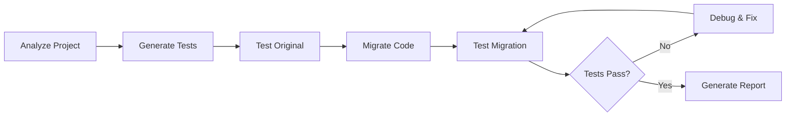

# Diversifier

> An LLM-based agent that performs automated library substitution in containerized projects while maintaining functional equivalence through rigorous testing.

## Why Diversifier?

In modern software deployment, **monoculture vulnerabilities** pose significant risks. When all instances of an application use identical dependencies, a single vulnerability can compromise the entire deployment. Diversifier addresses this through **automated software diversity** - a proven cybersecurity strategy.

### 🛡️ Security Through Diversity

**The Monoculture Problem:**
When your entire Kubernetes cluster runs identical containers with the same vulnerable library (e.g., a compromised HTTP client or JSON parser), attackers can:
- Exploit the vulnerability across all pods simultaneously
- Achieve complete service compromise with a single attack vector
- Bypass traditional security measures that assume attack diversity

**Diversifier's Solution:**
Generate functionally equivalent application variants using different libraries, enabling:
- **Reduced Attack Surface**: Different libraries have different vulnerability profiles
- **Blast Radius Limitation**: Exploits affect only a subset of your deployment
- **Rapid Incident Response**: Shift traffic to unaffected variants during security events

### 🎯 Moving Target Defense (MTD)

Diversifier implements **Moving Target Defense** principles by creating multiple valid targets:

```bash
# Before: Single target for attackers
kubectl get pods
NAME                     READY   STATUS
api-server-requests-1    1/1     Running  # All use requests library
api-server-requests-2    1/1     Running  # Same vulnerability
api-server-requests-3    1/1     Running  # Same attack vector

# After: Diversified deployment  
kubectl get pods
NAME                     READY   STATUS
api-server-requests-1    1/1     Running  # Uses requests
api-server-httpx-1       1/1     Running  # Uses httpx (different codebase)
api-server-aiohttp-1     1/1     Running  # Uses aiohttp (async)
```

**MTD Benefits:**
- **Attack Uncertainty**: Attackers cannot predict which library variant they'll encounter
- **Increased Attack Cost**: Requires multiple exploit chains for complete compromise
- **Dynamic Reconfiguration**: Adjust library distribution based on threat intelligence

### 🔀 Software Diversity & Randomization

Diversifier applies established **software diversity techniques** from systems security:

####  **Instruction Set Randomization (ISR) Inspiration**
Just as ISR randomizes instruction encodings to prevent code injection:
- **Library API Randomization**: Different libraries expose different APIs for identical functionality
- **Implementation Randomization**: Varies internal algorithms and data structures
- **Error Handling Randomization**: Different failure modes and exception patterns

#### **Address Space Layout Randomization (ASLR) Parallels**  
Similar to how ASLR randomizes memory layouts:
- **Dependency Randomization**: Varies the dependency graph structure
- **Call Stack Randomization**: Different function call patterns between libraries
- **Resource Usage Randomization**: Different memory and CPU usage patterns

### 🚀 Operational Advantages

**Zero-Downtime Security Response:**
```bash
# CVE discovered in requests library
kubectl scale deployment api-server-requests --replicas=0    # Scale down vulnerable variant
kubectl scale deployment api-server-httpx --replicas=10     # Scale up safe variant
# Service continues with zero downtime
```

**Canary Deployments for Security:**
- Deploy new library variants as canaries
- Test security posture with minimal traffic exposure  
- Gradually shift traffic based on security assessment

**Supply Chain Attack Mitigation:**
- Reduces dependency on single library maintainers
- Distributes supply chain risk across multiple projects
- Enables rapid pivot away from compromised dependencies

### 📊 Threat Model Coverage

| Attack Vector | Monoculture Risk | Diversified Defense |
|---------------|------------------|---------------------|
| **Library RCE** | 100% compromise | ~33% impact (varies by distribution) |
| **Supply Chain** | Complete takeover | Partial compromise, rapid mitigation |
| **Zero-Day Exploits** | Total exposure | Probabilistic protection |
| **Dependency Confusion** | Full deployment | Limited blast radius |
| **Insider Threats** | Single point of failure | Multiple targets required |

### 🎖️ Industry Alignment

**NIST Cybersecurity Framework:**
- **Identify**: Map library dependencies and vulnerability exposure
- **Protect**: Implement diversity-based protective controls
- **Detect**: Monitor variants for differential behavior
- **Respond**: Rapid incident response through traffic reshaping
- **Recover**: Maintain service availability during security events

**Zero Trust Architecture:**
- **Never Trust, Always Verify**: Each library variant operates under same security controls
- **Least Privilege**: Variants can have different permission sets if needed
- **Continuous Verification**: Monitor behavior across diverse implementations

### 🔬 Research Foundation

Diversifier builds on decades of academic research:

**Software Diversity Research:**
- [Instruction Set Randomization](https://people.csail.mit.edu/rinard/paper/asplos03.pdf) (MIT, 2003)
- [Address Space Layout Randomization](https://pax.grsecurity.net/docs/aslr.txt) (PaX Team, 2001)
- [N-Version Programming](https://ieeexplore.ieee.org/document/1702202) (Chen & Avizienis, 1978)

**Moving Target Defense:**
- [MTD Effectiveness Studies](https://www.dhs.gov/science-and-technology/csd-mtd) (DHS S&T)
- [Dynamic Platform Techniques](https://dl.acm.org/doi/10.1145/2435349.2435352) (ACM CCS, 2012)

**Modern Applications:**
- Container diversity in cloud deployments
- Microservice architecture resilience patterns
- DevSecOps integration strategies

When vulnerabilities are discovered in critical Python libraries, teams can quickly generate alternative versions of their applications using different libraries, allowing them to:
- **🛡️ Implement Defense in Depth**: Layer security through architectural diversity
- **⚡ Enable Rapid Response**: Reduce MTTR (Mean Time To Recovery) from hours to minutes  
- **🧪 Support Safe Testing**: Validate alternative implementations in production-like environments
- **🚀 Maintain Zero Downtime**: Deploy alternative versions alongside originals in Kubernetes
- **📈 Improve Security Posture**: Transition from reactive patching to proactive defense

## Quick Start

### Prerequisites

- Docker and Docker Compose
- Access to your Python project's source code
- Project must have a Dockerfile

### 1. Start MCP Servers

```bash
# Start required MCP servers (from the diversifier repo)
git clone https://github.com/mehrdad-abdi/diversifier
cd diversifier

# Start MCP servers from docker-compose
docker-compose -f mcp-servers/docker-compose.yml up -d
```

### 2. Run Migration

```bash
# Example: Migrate from requests to httpx
docker run --rm -it \
  --network mcp-network \
  -v /path/to/your/project:/workspace \
  diversifier /workspace requests httpx
```

### 3. Review Results

The agent will create a migrated version of your project and provide a comprehensive report showing:
- All code changes made
- Test results comparison  
- Performance impact analysis
- Deployment readiness confirmation

## How It Works



### 1. 🔍 Project Analysis
- Scans Python files for import statements and library usage
- Analyzes `requirements.txt`, `pyproject.toml`, `setup.py`
- Identifies all functions and methods using the target library
- Maps dependencies and potential compatibility issues

### 2. 🧪 Test Generation  
- Creates comprehensive acceptance tests covering current functionality
- Generates pytest-compatible test files
- Tests all API endpoints, data processing functions, and edge cases
- Establishes performance benchmarks

### 3. ✅ Baseline Validation
- Builds Docker container from original project
- Runs generated tests against original implementation  
- Captures baseline results, performance metrics, and coverage data
- Validates test reliability and completeness

### 4. 🔄 Code Migration
- Updates all import statements throughout codebase
- Translates function calls and API usage patterns
- Handles async/sync conversions when necessary
- Updates configuration files and dependencies

### 5. 🚀 Migration Testing
- Builds new Docker container with target library
- Runs identical test suite against migrated code
- Compares results with baseline metrics
- Identifies any functional or performance regressions

### 6. 🛠️ Debugging & Iteration
- Automatically fixes import errors and API mismatches
- Resolves type annotation conflicts
- Addresses performance issues
- Repeats testing cycle until all tests pass

### 7. 📋 Results & Reporting
- Generates comprehensive migration report
- Documents all code changes made
- Provides side-by-side comparison of test results
- Confirms production readiness


## Development Strategy

### Phase 1: Python MVP (Minimum Viable Product)
**Scope**: Focus exclusively on Python projects to establish core functionality and prove the concept.

**Target Libraries**: Common Python library substitutions
- HTTP clients: `requests` → `httpx` or `aiohttp`
- Database drivers: `psycopg2` → `asyncpg` or `SQLAlchemy` → `Tortoise ORM`
- JSON processing: `json` → `orjson` or `ujson`
- Logging: `logging` → `loguru`

**Benefits of Python-first approach**:
- Clear dependency management (requirements.txt, pyproject.toml)
- Predictable import patterns (`import`, `from X import Y`)
- Rich ecosystem of functionally equivalent libraries
- Mature containerization practices
- Excellent testing framework support

### Future Phases

Make the tool multi-language based on MVP feedback.

## Core Use Case

When a vulnerability is discovered in a critical Python library (e.g., a specific HTTP client, database driver, or JSON parser), teams can quickly generate an alternative version of their application using a different library, allowing them to:
- Maintain service availability by diversifying pod deployments
- Reduce blast radius of security vulnerabilities
- Test alternative implementations before full migration

## Project Structure

```
diversifier/
├── README.md                  # This file
├── src/                      # Main diversifier agent code
│   ├── main.py              # CLI entry point
│   ├── agent/               # Core LLM agent logic
│   │   ├── analyzer.py      # Project analysis engine
│   │   ├── test_generator.py # Acceptance test generation
│   │   ├── migrator.py      # Library substitution engine
│   │   └── validator.py     # Migration validation
│   ├── mcp_clients/         # MCP client interfaces
│   │   ├── docker_client.py
│   │   ├── git_client.py
│   │   ├── fs_client.py
│   │   └── testing_client.py
│   └── utils/               # Shared utilities
├── mcp-servers/             # MCP server implementations
│   ├── docker-mcp/          # Docker operations server
│   │   ├── Dockerfile
│   │   ├── server.py
│   │   └── requirements.txt
│   ├── git-mcp/             # Git operations server
│   │   ├── Dockerfile
│   │   ├── server.py
│   │   └── requirements.txt
│   ├── fs-mcp/              # File system operations server
│   │   ├── Dockerfile
│   │   ├── server.py
│   │   └── requirements.txt
│   ├── testing-mcp/         # Python testing server
│   │   ├── Dockerfile
│   │   ├── server.py
│   │   └── requirements.txt
│   └── docker-compose.yml   # MCP servers stack
├── docker-compose.yml       # Complete application stack
├── Dockerfile               # Main diversifier agent container
├── scripts/
│   ├── migrate.sh          # Convenience migration script
│   └── setup-dev.sh        # Development environment setup
└── tests/                   # Agent tests
```

## MCP Server Details

### 🐳 Docker MCP Server
- **Purpose**: Container lifecycle management
- **Capabilities**: Build images, run containers, manage volumes
- **Integration**: Mounts project code, executes tests in isolated environments

### 🔄 Git MCP Server
- **Purpose**: Version control operations
- **Capabilities**: Branch creation, file diff, commit tracking
- **Integration**: Creates migration branches, tracks all changes

### 📁 File System MCP Server
- **Purpose**: Project file manipulation
- **Capabilities**: Read/write Python files, parse dependencies
- **Integration**: Analyzes imports, modifies code, updates requirements.txt

### 🧪 Testing MCP Server
- **Purpose**: Test execution and analysis
- **Capabilities**: Run pytest, parse results, generate coverage reports
- **Integration**: Executes acceptance tests, compares baseline results

## License

MIT License - see [LICENSE](LICENSE) file for details.
